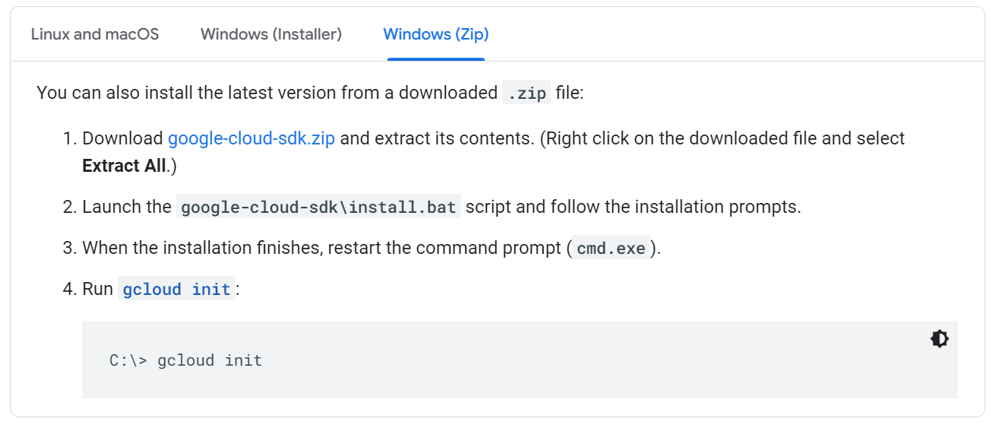

## 使用GCP API创建实例

#### 参考
https://cloud.google.com/compute/docs/reference/rest/v1/instances/insert#http-request
#### 1.安装python

#### 2.安装Google Cloud CLI
如果出现unzipping fails问题，可尝试直接下载[google-cloud-sdk.zip](https://dl.google.com/dl/cloudsdk/channels/rapid/google-cloud-sdk.zip)

参考 https://cloud.google.com/sdk/docs/downloads-interactive#windows



安装完成后，如果找不到 `gcloud` 命令则需在环境变量 `PATH` 中加入解压的SDK的bin目录如
```
C:\Users\ash\Downloads\google-cloud-sdk\bin
```