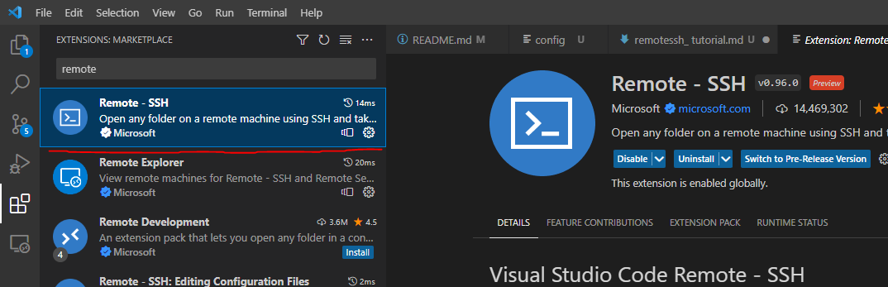
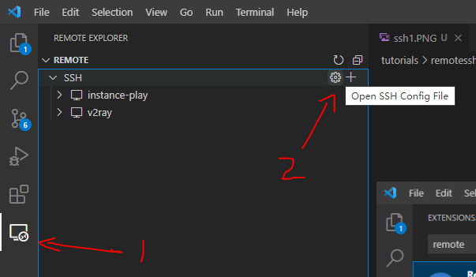
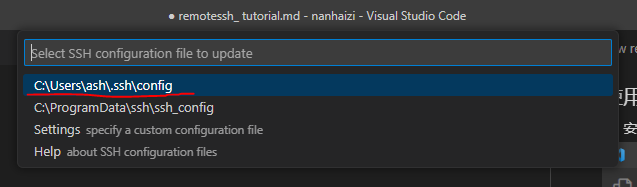
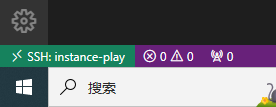

## 使用VSCode Remote SSH连接到主机

#### 1、安装VSCode与Remote SSH插件


#### 2、获取SSH私钥
[点击下载私钥](/host/sshkey/gcp-ssh-key)

###### Issue: Permissions for 'private-key' are too open 
在私钥文件的```属性-安全-高级```页面中禁用继承，所有者设置为本账户，并给本账户设置完全控制权限 [参考](https://superuser.com/questions/1296024/windows-ssh-permissions-for-private-key-are-too-open)

#### 3、打开SSH配置文件




#### 4、拷贝以下配置信息
```
Host instance-play
  HostName host.ashsaviour.xyz
  IdentityFile D:\ssh\gcp-ssh-key *改成你自己的路径
  User ashsaviour202301
```
保存后刷新

#### 5、连接
成功后VSCode左下角显示应为

